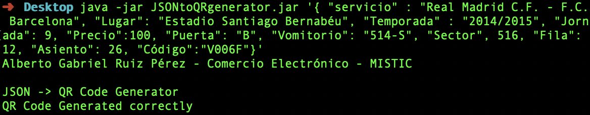

#### Haciendo uso de la librería zxing de java, podremos generar la imagen de un código QR a partir de un objeto JSON pasado como parámetro.

###### Ejemplo de ejecución con el ejecutable .jar:

###### Obtenemos la siguiente imagen como salida:

